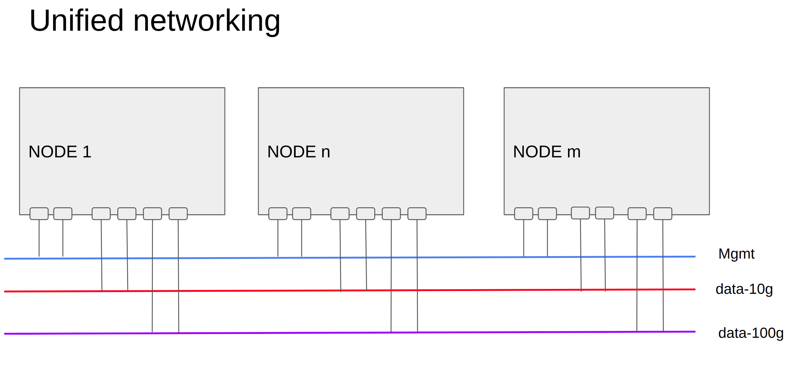
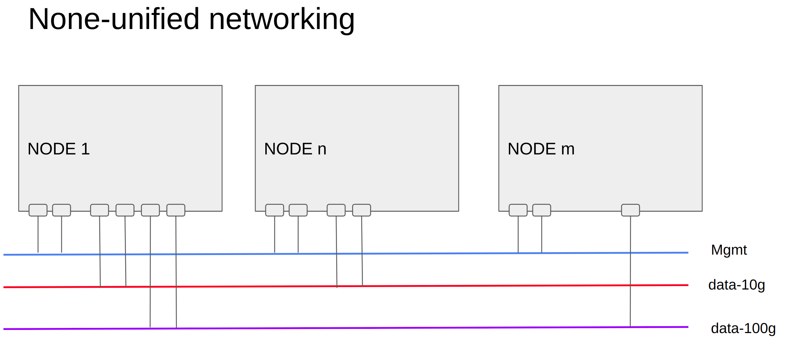
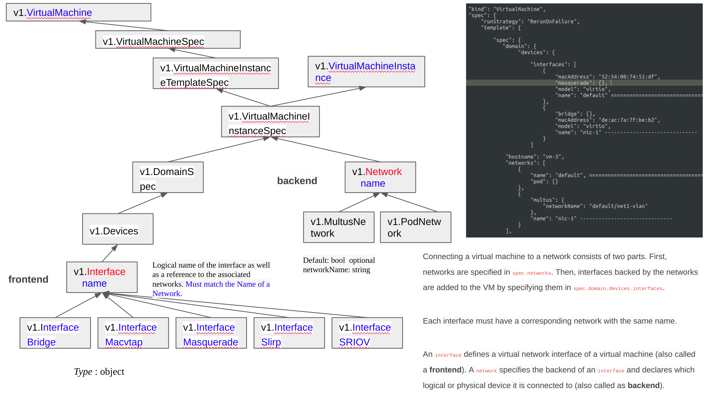
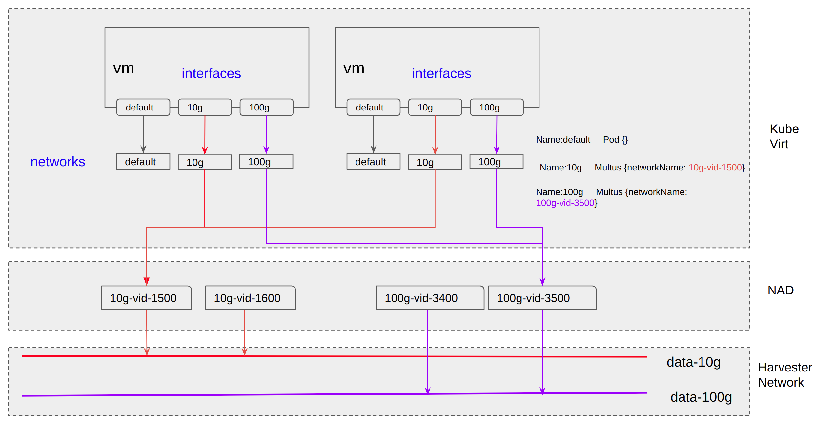
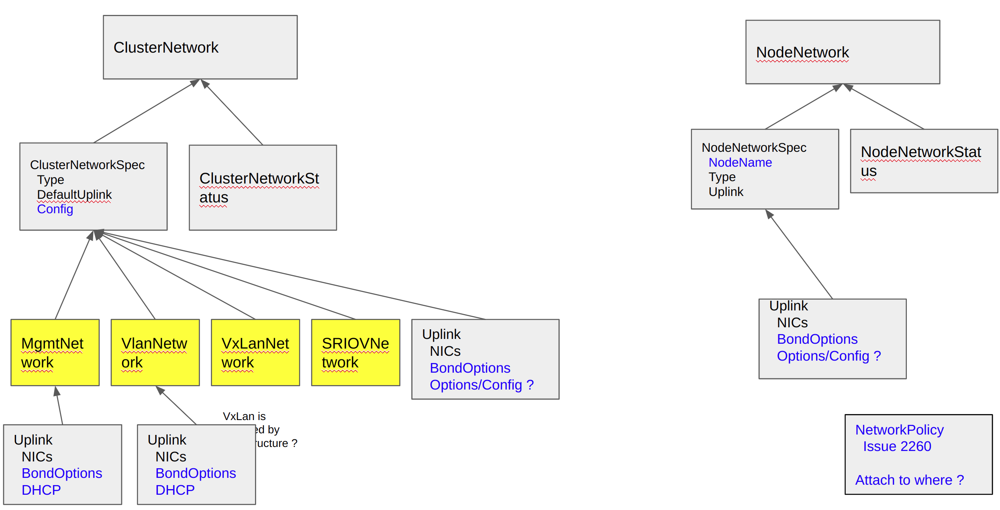

# Title

VLAN HEP

## Summary

The enhanced Harvester network will support VLAN in both management and other networking.

### Related Issues

https://github.com/harvester/harvester/issues/2161
https://github.com/harvester/harvester/issues/2236
https://github.com/harvester/harvester/issues/2259


## Motivation
.

### Goals

  * Management network supports VLAN
  * None-management network supports VLAN
  * (Future) Supports more network types

### Non-goals [optional]

https://github.com/harvester/harvester/issues/2260

## Proposal
.

### User Stories

In Harvester, we have following assumptions:

```
  * User provides physical network connectivity, all the physical NICs of each NODE will be attached to networks now or then
  * Multi networks may exist
  * Management network is always existing, each NODE has at least one NIC attached to it
```

A detailed explanation of Harvester networking is in [harvester network samples](#harvester-network-samples) .

One user plans to install Harvester cluster, and assume:

```
  User prepares 3 networks: mgmt (type VLAN), VLAN ID 100;  data-10g (type VLAN), VLAN ID 1000~2000; data-100g (type VLAN), VLAN ID 3000~4000
  User has 20 NODEs, each NODE has 6 NICs, eth1, eth2 are in mgmt;  eth3, eth4 are in data-10g;  eth5, eth6 are in data-100g
```

Following stories are about the installation and usage of Harvester Network.

```
  Story 1  Install cluster via PXE, all ClusterNetworks are ready
  Story 2  Install cluster via PXE,, only management ClusterNetwork is ready
  Story 3  Install cluster via ISO UI manually, only management ClusterNetwork is ready
  Story 4  Add unified NODE to cluster
  Story 5  Add none-unified NODE to cluster
  Story 6  Delete NODE from cluster

  Story 7  Add management VLAN ID to an existing cluster
  Story 8  Change management VLAN ID
  Story 9  Delete management VLAN ID

  Story 10 Set the VLAN ID range for ClusterNetwork
  Story 11 Set MTU or other ethernet parameter at ClusterNetwork level

  Story 12 Add new ClusterNetwork
  Story 13 Delete none-management ClusterNetwork
  Story 14 Allow a new ClusterNetwork uses management interface

  Story 15 Create NAD with VLAN ID check
  Story 16 Create NAD with ClusterNetwork ready check
```

#### Story 1
Install cluster via PXE, all ClusterNetworks are ready

```
Installation:
 "create-cluster" NODE:
	  claim 3 cluster networks, say mgmt, data-10g, data-100g, all are VLAN based
	  claim 6 nics are attached to 3 networks
	  claim mgmt VLAN ID, static/dhcp
	  claim VIP static/dhcp

 "join-cluster" NODEs:
	  claim 6 nics are attached to 3 networks
	  claim mgmt VLAN ID, static/dhcp
```

After cluster installation is finished:

```
  VIP, NODE managment IP are reachable
  3 cluster networks are ready, each NODE has it's node-agent, say br-mgmt, br-data-10g, br-data-100g
```

#### Story 2

Install cluster via PXE,, only management ClusterNetwork is ready

```
  "create-cluster" NODE:
	  claim 2 nics are attached to mgmt network
  	claim mgmt VLAN ID, static/dhcp
	  claim VIP static/dhcp

  "join-cluster" NODEs:
	  claim 2 nics are attached to mgmt networks
	  claim mgmt VLAN ID, static/dhcp
```

After cluster installation is finished:

```
  VIP, NODE managment IP are reachable
  a default mgmt cluster network is ready, each NODE has it's node-agent, say br-mgmt
```


From Harvester WebUI/CLI, user continues to add more cluster networks:


```
  Create another 2 cluster network: data-10g, data-100g
    set eth3,eth4 as data-10g's uplink;  eth5,eth6 as data-100g's uplink
```

(current: Enabling Default VLAN Network   Settings > vlan, but only 1 instance )

#### Story 3

Install cluster via ISO UI manually, only management ClusterNetwork is ready

```
  "create-cluster" NODE:
	  set 2 nics are attached to mgmt network
  	set mgmt VLAN ID, static/dhcp
	  set VIP static/dhcp

  "join-cluster" NODEs:
	  set 2 nics are attached to mgmt networks
	  set mgmt VLAN ID, static/dhcp
```

After cluster installation is finished:

```
  VIP, NODE managment IP are reachable
  a default mgmt cluster network is ready, each NODE has it's node-agent, say br-mgmt
```


#### Story 4

Add unified NODE to cluster

```
  User plans to add a new NODE, which has similar hardware with existing NODEs
	The readiness of network is similar to previous stories
```


#### Story 5
Add none-unified NODE to cluster

```
  User plans to add a new NODE, which has only 2 NICs, eth1 to management network, eth2 to data-10g, no NIC to data-100g

	The readiness of network is similar to previous stories; user needs to change PXE config file, or add cluster-network manually.
```

NOTE: There are challenges of this story, especially to the VM scheduling, ClusterNetwork conditions will be involved.

#### Story 6

Delete NODE from cluster

```
  User plans to delete a NODE from cluster

	Follow the current deleting NODE process.
```


#### Story 7

Add management VLAN ID to an existing cluster

```
  When cluster is installed/upgraded, it has no management VLAN ID, then, the user wishes to add the management VLAN ID.
  Due to the fact that NODE IP CAN NOT be changed, this scenario may not be supported.
  But customer may have such requirement...

  Management IP (node IP) is either staticly assigned, or from DHCP, when VLAN ID is added to management network, 
communication between NODEs may have break.
```


#### Story 8

Change management VLAN ID

```
  When cluster is running, user wishes to change the management VLAN ID
  Due to the fact that NODE IP CAN NOT be changed, this scenario may not be supported.
  But customer may have such requirement...
```

#### Story 9

Delete management VLAN ID

```
  When cluster is running, user wishes to delete the VLAN ID of the management network.
  Due to the fact that NODE IP CAN NOT be changed, this scenario may not be supported.
  But customer may have such requirement...
```

#### Story 10

Set the VLAN ID range for ClusterNetwork

```
  (Physical) Network administrator configures a range of VLAN ID for a specific Harvester cluster, to avoid mismatching, 
Harvester administrator also wishes to config the related VLAN ID range into ClusterNetwok,
thus, the later NAD configure will not be wrong.
```

#### Story 11

Set MTU or other ethernet parameter at ClusterNetwork level

```
  Each type of cluster network have related parameters. For instance, for L2 VLAN network, user plan to config the MTU.
Set it in each NODE is OK, but if it could be set from ClusterNetwork, it is user friendly.
```


#### Story 12

Add new ClusterNetwork

```
  When cluster is running, user adds a new ClusterNetwork.
  For example, nic3, nic4 are attached to ClusterNetwork data-10g now. User does following operations:
  
  Option A:
  (1) Detach nic4 from data-10g in each node
  (2) Physical Network administrator configure another physical network for nic4
(e.g add a new range of VIDs for the nic4 connected switch ports)
  (3) Create new ClusterNetwork data-10g-2, set default uplink as nic4
  (4) Nic4 in each node is attached to data-10g-2 automatically

  or
  Option B:
  (1) Create new ClusterNetwork data-10g-2, set default uplink as empty
  (2) Detach nic4 from data-10g in each node
  (3) Physical Network administrator configure another physical network for nic4
(e.g add a new range of VIDs for the nic4 connected switch ports)
  (4) Attach nic4 to data-10g-2 in each node manually
```

Note, a ClusterNetwork may has no default uplink, it's ready status should be defined.


#### Story 13

Delete none-management ClusterNetwork

```
  When cluster is running, user deletes a new ClusterNetwork.
  For example, nic3, nic4 are attached to ClusterNetwork data-10g now. nic5, nic6 are attached to ClusterNetwork data-100g.
User does following operations:

  (1) Delete ClusterNetwork data-100g

  When there are NADs connecting to data-100g, the user is required to delete those NADs first.
  When there are NO NADs connecting to data-100g, the ClusterNetwork is allowed to be deleted, after that, 
nic5, nic6 are ready to use for another ClusterNetwork.

```

#### Story 14

Allow a new ClusterNetwork uses management interface

```
  User creates a new ClusterNetwork, but in some nodes, it has no dedicated uplink,
then user sets the uplink of this ClusterNetwork to be the management interface
```

note: it's argued if such story is practical, as it cannot isolate and may affect management network


#### Story 15

Create NAD with VLAN ID check

```
  NAD is a cluster level concept.
  NAD is configured to attach to ClusterNetwork with related parameters, e.g. when ClusterNetwork is VLAN network, then VLAN ID needs to be set

  The VLAN ID should be in range for ClusterNetwork's allowed VLAN ID (by default, 1~4094)
```

  (current: A new VLAN network can be created via the Advanced > Networks page and clicking the Create button.)


#### Story 16

Create NAD with ClusterNetwork ready check

```
  Per sotry 12 'Add new ClusterNetwork', when a new ClusterNetwork is under construction, it is not spread all over the Cluster,
NAD to this ClusterNetwork should be blocked.

	It is also affected by story Story 5 'Add none-unified NODE to cluster'
```


### User Experience In Detail

#### Harvester Network Samples

Ideally, each NODE in Harvester has similar networking connections like following.




But in reality, NODE may have different nics connecting to different networks, for instance, mixed developing & deployment NODEs, some NODEs have GPU/SRIOV/..., none-unified networking is a challenge.




[back to user stories](#user-stories)


#### KubeVirt network and interface

KubeVirt has a concept of interface (frontend) and network (backend), network is related to NAD, interface is the NIC for VM, which takes care of different interfaces related to libvirt.



#### End to end network

Undoubtly, KubeVirt's interface and network, plus NAD, is NODE-independent. In an unified cluster, VM is freely to be scheduled to any NODE as long as resources are enough.




#### Harvester network extension proposal

A proposal, for discussion.



### API changes

## Design

### Implementation Overview

Overview on how the enhancement will be implemented.

### Test plan

Integration test plan.

### Upgrade strategy

Anything that requires if user want to upgrade to this enhancement

## Note [optional]

Additional nodes.
