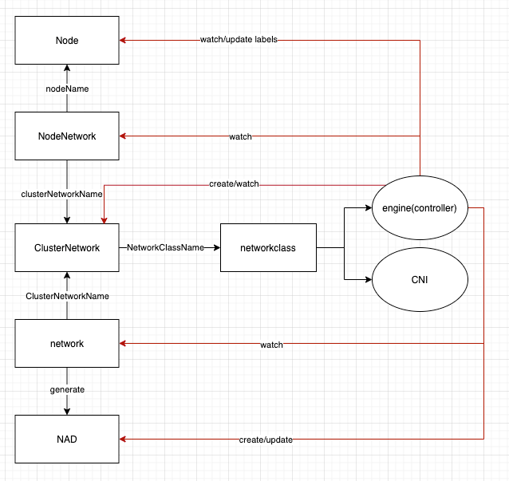

## Summary

### Related Issues

## Motivation

### Goals

- Implement network type abstraction
- Separate controllers for each network type

## Proposal

### User Stories

### User Experience In Detail

### API changes

1. NetworkClass

``` go 
// +genclient
// +genclient:nonNamespaced
// +k8s:deepcopy-gen:interfaces=k8s.io/apimachinery/pkg/runtime.Object
// +kubebuilder:resource:shortName=nc;nc,scope=Cluster

type NetworkClass struct {
	metav1.TypeMeta   `json:",inline"`
	metav1.ObjectMeta `json:"metadata,omitempty"`

	Spec NetworkClassSpec `json:"spec"`
}

type NetworkClassSpec struct {
	Engine  string `json:"engine"`
	CNIName string `json:"cniName"`
}
```

2. ClusterNetwork

``` go 
// +genclient
// +genclient:nonNamespaced
// +k8s:deepcopy-gen:interfaces=k8s.io/apimachinery/pkg/runtime.Object
// +kubebuilder:resource:shortName=cn;cns,scope=Cluster

type ClusterNetwork struct {
	metav1.TypeMeta   `json:",inline"`
	metav1.ObjectMeta `json:"metadata,omitempty"`

	Spec   ClusterNetworkSpec   `json:"spec,omitempty"`
	Status ClusterNetworkStatus `json:"status,omitempty"`
}

type ClusterNetworkSpec struct {
	// +optional
	Description string `json:"description,omitempty"`

	NetworkClassName string `json:"NetworkClassName"`

	DefaultOptions Options `json:"DefaultOptions"`
}

type Options struct {
	VLANOptions  *VLANOptions  `json:"vlanOptions,omitempty"`
	VxLanOptions *VxLanOptions `json:"vxLanOptions,omitempty"`
}
```

3. NodeNetwork

``` go
type NodeNetwork struct {
	metav1.TypeMeta `json:",inline"`
	// add the relevant clusterNetwork as owner reference
	metav1.ObjectMeta `json:"metadata,omitempty"`

	Spec   NodeNetworkSpec   `json:"spec,omitempty"`
	Status NodeNetworkStatus `json:"status,omitempty"`
}

type NodeNetworkSpec struct {
	// +optional
	Description string `json:"description,omitempty"`

	NodeName string `json:"nodeName"`
	
	ClusterNetworkName string `json:"clusterNetworkName"`

	Options Options `json:"options"`
}
```

4. Network

``` go 
type Network struct {
	metav1.TypeMeta   `json:",inline"`
	metav1.ObjectMeta `json:"metadata,omitempty"`

	Spec NetworkSpec `json:"spec"`
}

type NetworkSpec struct {
	ClusterNetworkName string      `json:"clusterNetworkName"`
	Conf               NetworkConf `json:"conf"`
}

type NetworkConf struct {
	VLANConf  *VLANConf  `json:"vlanConf"`
	VxLanConf *VxLanConf `json:"vxLanConf"`
}

type VLANConf struct {
	VID uint `json:"vid"`
}

type VxLanConf struct {
	VNI uint `json:"VNI"`
}
```

## Design

### Implementation Overview

- The NetworkClass CRD contains the engine and CNI. Developers add a new NnetworkClass CR if they add a new network implementation including a set of controllers and a CNI plugin.
- Every ClusterNetwork CR specifies a NetworkClass CR. 
- Every NodeNetwork corresponds to a Node and a ClusterNetwork CR. The network engine will create the NodeNetwork CR and setup/tear down the network for every node. It is worth mentioning that the engine will update the node labels to indicate whether the node satisfy the network requirement. 
- Every Network CR specifies a ClusterNetwork CR. The network engine will generate the NAD according to the Network CR.

### Test plan

### Upgrade strategy